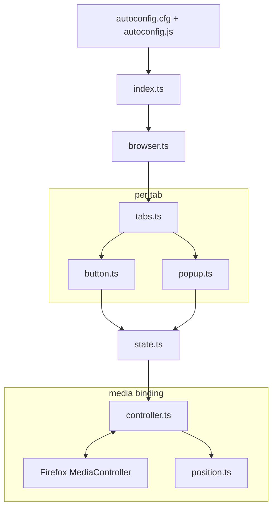

# FX Media Controler

Media Controller UI on Firefox tabs, driven by Firefox's internal `MediaController` API.

> [!WARNING]
>
> ### Security warning
>
> `FX Media Controler` uses Firefox AutoConfig to load privileged JavaScript at browser startup. It is **not a WebExtension** and does not run in the WebExtension sandbox — it runs with chrome-level access to Firefox internals.
>
> Review `autoconfig.js`, `autoconfig.cfg`, and the built `fx-media-controller.js` before installing. Don't install this, or anything using AutoConfig, if you're not willing to read the code you're trusting with that access.
>
> See Mozilla's [AutoConfig docs](https://support.mozilla.org/en-US/kb/customizing-firefox-using-autoconfig) for background.

## Contents

- [What this is](#what-this-is)
- [Why not a WebExtension](#why-not-a-webextension)
- [How it works](#how-it-works)
- [Limitations](#limitations)
- [Requirements](#requirements)
- [Installation](#installation)
- [Troubleshooting](#troubleshooting)
- [Uninstallation](#uninstallation)
- [Development](#development)
- [Compatibility](#compatibility)
- [License](#license)

## What this is


A tab-strip Play/Pause button plus a floating popup panel. Inspired by Firefox's native media popups.

Built on Firefox's internal `MediaController` — the same mechanism behind `about:mediacontrol` and the OS-level media keys integration. No content script, no page injection.

## Why not a WebExtension

WebExtensions can't do this. The `MediaController` API isn't exposed to the WebExtension API surface — it's chrome-only. A regular extension can react to media indirectly (e.g. the tab's audio icon) but can't query or drive playback state per tab the way this does, and can't render UI _inside_ the tab strip itself.

Getting that requires chrome-privileged script, which for a non-extension means AutoConfig. That's the whole reason this project exists in this shape — not a design preference, a constraint of the API being used.

The trade-off: no WebExtension sandbox, no store review, no auto-update, manual install, and breakage risk on every Firefox internals change. Weigh that before installing.

## How it works



- **`index.ts`** — entry point loaded by AutoConfig. Initializes the current window, then watches for new ones (`domwindowopened`).
- **`browser.ts`** — wires up one browser window: tab open/close listeners, location-change listener, teardown on window unload.
- **`tabs.ts`** — per-tab lifecycle: creates/destroys the button, attaches hover events for the popup.
- **`button.ts`** — the tab-strip icon. Subscribes to tab media state, toggles play/pause on click.
- **`popup.ts`** — the hover popup (title, artwork, seek, track controls).
- **`state.ts`** — `TabMediaState`: per-tab pub/sub wrapper around a controller binding, one per tab, cached in a `WeakMap`.
- **`controller.ts`** — the actual `MediaController` binding: event listeners, capability detection, state caching.
- **`position.ts`** — interpolates playback position between real `positionstatechange` events (RAF loop), only while the popup is open.

## Limitations

- **No volume control.** `MediaControlKey` includes `'setvolume'`, but `MediaController` exposes no method to set volume — only `mute()` / `unmute()`. Confirmed against the interface itself; not a bug in this project, a gap in the Firefox API.
- **No seek bar on sites that don't report position.** Position data comes only from `navigator.mediaSession.setPositionState()` calls made by the page. Sites that never call it (some players don't) show play/pause but no scrubber or time.
- **Only the main browser window is instrumented.** `browser.ts` bails out unless `location.href` is exactly `chrome://browser/content/browser.xhtml`. Popup windows, PiP, and other chrome windows aren't covered.
- **Internal API, not a stable one.** `MediaController` is undocumented outside Mozilla's own source. Firefox releases can change or remove it without notice, per [Mozilla's own caveat](https://searchfox.org/firefox-main/source/dom/chrome-webidl/MediaController.webidl).
- **One AutoConfig entry point.** Firefox only loads one `autoconfig.cfg`. If you already use AutoConfig for something else, installing this without merging configs will break the other one.

## Requirements

- Firefox desktop (Windows, macOS, Linux)
- A Firefox installation you can write to (admin/root may be required)
- A Firefox profile with `chrome/` customization enabled

Building from source additionally needs Node.js — see [Development](#development). Using a release build does not.

## Installation

### Before you start

Close Firefox completely, then extract the release archive. You need:

```text
autoconfig.js
autoconfig.cfg
fx-media-controller.js
fx-media-controller.css
```

Two destinations: the **Firefox installation directory** (AutoConfig files) and the **Firefox profile** (`fx-media-controller` files).

### 1. Find the Firefox installation directory

The folder containing the Firefox executable.

| OS      | Typical path                                    |
| ------- | ----------------------------------------------- |
| Windows | `C:\Program Files\Mozilla Firefox\`             |
| macOS   | `/Applications/Firefox.app/Contents/Resources/` |
| Linux   | `/usr/lib/firefox/` or `/usr/lib64/firefox/`    |

Package-managed Linux builds vary — find wherever `firefox` (the binary) actually lives.

### 2. Install the AutoConfig files

Copy `autoconfig.cfg` into that directory.

Copy `autoconfig.js` into `<install dir>/defaults/pref/`.

```text
<Firefox installation>/
├── autoconfig.cfg
└── defaults/pref/autoconfig.js
```

> Already using AutoConfig for something else? Don't overwrite `autoconfig.cfg` blind — merge it. Firefox loads exactly one.

### 3. Find your Firefox profile

`about:support` → **Profile Folder** → **Open Folder**.

### 4. Install the fx-media-controller files

Inside the profile, create `chrome/JS/` if it doesn't exist, then:

```text
<Firefox profile>/
└── chrome/
    ├── JS/fx-media-controller.js
    └── fx-media-controller.css
```

### 5. Load the stylesheet

`@import` in `userChrome.css` is unreliable in some setups. Skip it — paste the contents of `fx-media-controller.css` directly into `userChrome.css` instead. If you don't have one yet, create `chrome/userChrome.css` and paste the styles in as-is.

If you'd rather try `@import` first:

```css
@import url('fx-media-controller.css');
```

Either way, set in `about:config`:

```text
toolkit.legacyUserProfileCustomizations.stylesheets = true
```

Restart Firefox.

### 6. Verify

Open a tab with playing media. The Play/Pause button should appear on the tab and reflect playback state on click.

## Troubleshooting

**Button doesn't appear** — confirm `fx-media-controller.js` is at `<profile>/chrome/JS/`, `autoconfig.cfg` is in the install directory, `autoconfig.js` is in `defaults/pref/`. Restart Firefox fully. Check the [Browser Console](https://firefox-source-docs.mozilla.org/devtools-user/browser_console/index.html) for errors.

**CSS not applied** — confirm the pref is `true`, and confirm you pasted the styles into `userChrome.css` (not just `@import`, per step 5).

**AutoConfig error** — check file placement matches step 2 exactly, files copied unmodified, Firefox was fully closed while replacing them, no second AutoConfig config is present.

**Worked, then broke after a Firefox update** — updates can replace files in the install directory; re-check step 2. If files are intact and it still doesn't work, Firefox likely changed the internal API this depends on — see [Limitations](#limitations).

## Uninstallation

Close Firefox. Remove:

```text
<Firefox installation>/autoconfig.cfg
<Firefox installation>/defaults/pref/autoconfig.js
<Firefox profile>/chrome/JS/fx-media-controller.js
<Firefox profile>/chrome/fx-media-controller.css
```

Remove the pasted styles (or the `@import` line) from `userChrome.css` — don't delete the file itself if it has other content.

## Development

```bash
npm run typecheck   # tsc --noEmit
npm run lint        # oxlint
npm run format      # oxfmt
npm run check:deps  # knip
npm run build       # node build.mjs -> dist/
```

`npm run check` runs typecheck, lint, format:check, and check:deps together. CI (`.github/workflows/release.yml`) runs on Node 24 and builds with `FXMC_LOG_LEVEL=error`.

## Compatibility

Tied to Firefox internals, not a stable extension API — compatibility can change between Firefox releases without warning. Developed and tested against the version documented in the current release's notes.

## License

MIT — see [LICENSE](LICENSE).

## References

- [Mozilla — Customize Firefox using AutoConfig](https://support.mozilla.org/en-US/kb/customizing-firefox-using-autoconfig)
- [Mozilla Searchfox](https://searchfox.org/)
- [fx-autoconfig](https://github.com/MrOtherGuy/fx-autoconfig)
